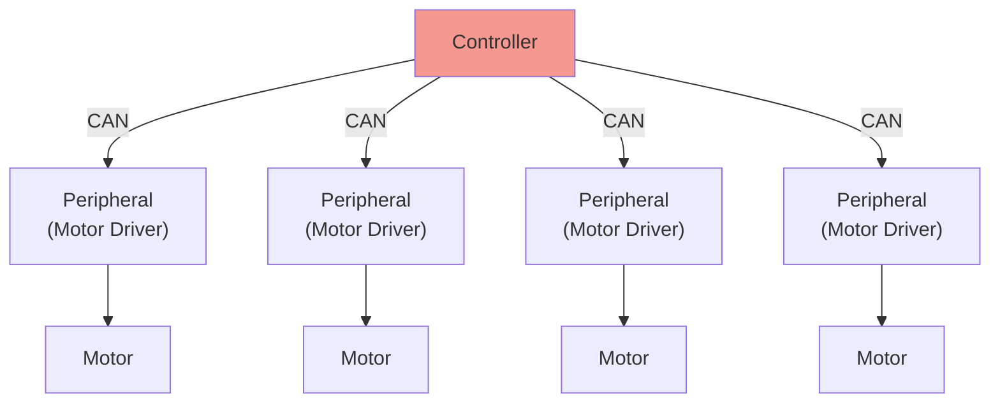

# Spirit Mbed CAN Motor Controller

[spirit](https://github.com/yutotnh/spirit) を用いた Mbed の モータードライバ制御プログラム

下の図の赤のノードに相当します
CANで接続したspiritを利用したモータードライバを動作することを目的としたプログラムです



## ⌨️ Development

### 🛠️ Build

リポジトリのルートディレクトリで下の手順を行うことで、ビルドできます

#### Mbed CLI 1

詳しくは、[公式のドキュメント](https://os.mbed.com/docs/mbed-os/latest/build-tools/mbed-cli.html)を参照してください

```shell
mbed deploy
mbed compile -t GCC_ARM -m NUCLEO_F303K8 # ビルドターゲットを STM32F303K8 でビルド
```

#### Mbed CLI 2

詳しくは、[公式のドキュメント](https://os.mbed.com/docs/mbed-os/latest/build-tools/mbed-cli-2.html)を参照してください

```shell
mbed-tools deploy
mbed-tools compile -t GCC_ARM -m NUCLEO_F303K8 # ビルドターゲットを STM32F303K8 でビルド
```
